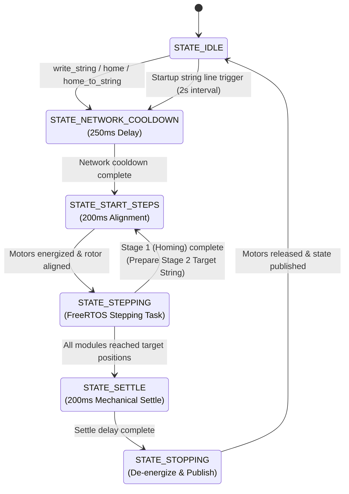

# ESPHome Split-Flap Display Component

An ESPHome custom component for driving the excellent modular 3D-printed split-flap displays originally designed by [Morgan Manly](https://github.com/ManlyMorgan/Split-Flap-Display) and [expanded upon](https://drewferg11.github.io/Split-Flap-Display/) by community members.

It supports multi-module configurations using **PCF8575 I/O expanders** over I2C, features high-performance motor stepping using a dedicated FreeRTOS task, and supports real-time calibration offsets mapped to ESPHome `number` entities.

## Firmware Architecture

- **Dedicated FreeRTOS Task**: Runs motor stepping sequences in a high-priority task (Priority 24) on Core 0 with hybrid busy-wait/yielding, mitigating timing jitter caused by ESPHome's main loop and WiFi network stack.
- **Real-Time Offset Calibration**: Link each module's offset to an ESPHome `number` entity, enabling runtime fine-tuning from Home Assistant.
- **Startup Display Sequences**: Supports multi-line startup strings displayed sequentially during boot.

### Display State Machine



- **`STATE_IDLE`**: The default resting state when no motor movement is taking place. If multi-line `startup_string` text is configured, this state periodically triggers the display of the next line (at 2-second intervals).
- **`STATE_NETWORK_COOLDOWN`**: A 250ms buffer delay entered immediately after receiving a display or homing command. This gives the ESP32 network stack (WiFi, mDNS, and Home Assistant API encryption) time to settle before high-frequency motor stepping starts.
- **`STATE_START_STEPS`**: A 200ms delay that energizes the stepper motor coils to align the physical rotors to the magnetic field phase before stepping starts.
- **`STATE_STEPPING`**: The active movement state managed by a high-priority FreeRTOS task (Priority 24) on Core 0. The task steps modules toward target positions and polls Hall effect sensors for zero-position calibration at the magnet trailing edge. During homing, completing Stage 1 (finding the magnet) transitions back to `STATE_START_STEPS` to execute Stage 2 (moving to the target character).
- **`STATE_SETTLE`**: A 200ms settling pause after stepping finishes to allow the physical flaps and drum mechanisms to come to a complete rest.
- **`STATE_STOPPING`**: De-energizes the motor coils (if configured to release), stops high-frequency loop requests, and publishes the final text state to Home Assistant before returning to `STATE_IDLE`.

### Comparison to Original C++ Firmware

This custom component ports the core split-flap movement and homing logic from the original [C++ firmware](https://github.com/ManlyMorgan/Split-Flap-Display) and the [fork by DrewFerg11](https://github.com/DrewFerg11/Split-Flap-Display) into a native ESPHome architecture. Some key differences & tradeoffs:

| Dimension | Custom Firmware Architecture | ESPHome Custom Component | Tradeoffs |
| :--- | :--- | :--- | :--- |
| **Execution & Threading** | Single-threaded blocking `loop()`. | **Dual-Thread Architecture**: High-priority FreeRTOS task (Priority 24, Core 0) with hybrid yield/busy-wait execution and a 250ms network cooldown buffer. | Single-threading maximizes timing precision; is simpler, but harder to integrate with other logic. |
| **Configuration** | WebUI runtime config; most parameters hardcoded. | Declarative ESPHome YAML config with support for binding to dynamic entities. | Custom firmware offers simple UI configuration but less flexibility. ESPHome integrates with shared secrets, fleets, and dynamic entities. |
| **Smart Home Integration & Management** | Custom MQTT implementation with MQTT auto-discovery. | Native ESPHome `text` platform entity with automatic Home Assistant API discovery. | ESPHome eliminates custom API maintenance and adds native OTA updates and wireless logging, but carries higher overhead. |
| **Expansion** | Adding extra peripherals (sensors, LEDs, buttons) or onboard logic requires custom C++ code. | Native integration  with ESPHome component ecosystem (sensors, NeoPixels, rotary encoders). | Custom firmware requires writing C++ drivers for hardware changes; ESPHome enables adding sensors, controls, and logic declaratively via YAML. |
| **Connectivity** | Custom WiFi implementation | ESPHome WiFi implmenetation. | ESPHome supports more configurable and robust WiFi stack with auto-reconnect, AP steering, captive portal, etc. |

tl;dr: ESPHome provides a more robust + feature rich foundation, but because the logic runs in a more cooperative environemnt, may not be as timing precise.

## Hardware Configuration

See [here](https://drewferg11.github.io/Split-Flap-Display/resources/) for more info.

Each split-flap module uses a PCF8575 expander connected to the shared I2C bus (`SDA`/`SCL`). The PCF8575 pins are mapped as follows:

| PCF8575 Pin | Function | Description |
| :--- | :--- | :--- |
| **P01 - P04** (Bits 1 - 4) | Stepper Motor Phases | Connected to the stepper driver inputs (e.g., ULN2003) |
| **P17** (Bit 15) | Hall Effect Sensor | Input pin with internal pull-up. Connected to the sensor output (Active LOW) |

## Firmware Installation & Configuration

> [!NOTE]
> Since stepper accuracy and precision is influenced by CPU load, you will likely want to run this on a dedicated board.

### Example Configuration

A complete example configuration is available in the [`esphome-splitflap.yaml`](esphome-splitflap.yaml) file. To use it'll you'll need to declare the following varaibles in your `secrets.yaml` file:

```yaml
wifi_ssid: [YOUR_WIFI_SSID]
wifi_password: [YOUR_WIFI_PASSWORD]
home_assistant_key: [YOUR_HOME_ASSISTANT_KEY]
ota_password: [YOUR_OTA_PASSWORD]
```

Deploy to your device using `esphome run esphome-splitflap.yaml`, or install via the ESPHome dashboard by using the "Install from Folder" option.

### Configuration Details

#### Component Installation

Add this custom component to your ESPHome configuration file using the `external_components` block.

##### Local Installation

If you clone or download this repository locally into your ESPHome configuration directory:

```yaml
external_components:
  - source:
      type: local
      path: components
    components: [ split_flap ]
```

##### Git Installation

Or source it directly from GitHub:

```yaml
external_components:
  - source:
      type: git
      url: https://github.com/chen-ye/esphome-split-flap.git
      ref: main
    components: [ split_flap ]
```

#### Split-Flap Text Platform

The component exposes itself as an ESPHome `text` component platform.

```yaml
text:
  - platform: split_flap
    name: "Display Text"
    id: split_flap_display

    # Global Hardware Settings
    steps_per_rot: 2048
    magnet_position: 730
    display_offset: 0
    max_vel: 15.0

    # Character Configuration
    charset: " ABCDEFGHIJKLMNOPQRSTUVWXYZ0123456789':/?!.->$#%"

    # Startup Behavior
    home_on_startup: true
    startup_string: |
      HELLO
      WORLD

    # Module Definitions
    modules:
      - address: 0x20
        offset: offset_0
      - address: 0x21
        offset: offset_1
```

#### Config Variables

- **name** (**Required**, string): The name of the text entity in Home Assistant.
- **id** (**Required**, ID): The ID of the component to reference in actions and scripts.
- **steps_per_rot** (*Optional*, integer): Total steps required for one full rotation of the drum. Defaults to `2048` (standard for 28BYJ-48 stepper motors).
- **magnet_position** (*Optional*, integer): The step position where the magnet is detected relative to the start of the character sequence. Should be `730` for 37-character modules and `615` for 48-character modules.
- **display_offset** (*Optional*, integer): Global step offset applied to all modules. Defaults to `0`.
- **max_vel** (*Optional*, float): The maximum rotation speed in RPM. Defaults to `15.0`.
- **charset** (*Optional*, string): The ordered list of characters printed on the physical flaps.
  - Length `< 37`: Defaults to the standard 37-character set (`ABCDEFGHIJKLMNOPQRSTUVWXYZ0123456789`).
  - Length `>= 48`: Defaults to the extended 48-character set (`ABCDEFGHIJKLMNOPQRSTUVWXYZ0123456789':/?!.->$#%`).
- **home_on_startup** (*Optional*, boolean): Whether to home the display immediately upon boot. Defaults to `true`.
- **startup_string** (*Optional*, string): Multi-line string. If provided, lines are displayed sequentially on the display (2 seconds per line) after a boot/homing sequence finishes.
- **modules** (**Required**, list): The list of split-flap modules from left to right.
  - **address** (**Required**, I2C address): The I2C address of the PCF8575 for this module (e.g., `0x20`).
  - **offset** (*Optional*, integer or template number ID): The calibration offset for this module. Referencing an ESPHome `number` entity allows you to dynamically change offsets via the UI without rebuilding the firmware. Defaults to `0`.

## Calibration Offset Tuning

Because of physical tolerances and magnet placements, each module will require slight step calibration to ensure flaps align perfectly flat in the window.

To make this easy, map the `offset` parameter of each module to an ESPHome `template number` entity:

```yaml
number:
  - platform: template
    id: offset_0
    name: "Module 0 Offset"
    min_value: -100
    max_value: 100
    step: 1
    initial_value: 0
    optimistic: true
    restore_value: true
```

Use the following cheatsheet to calibrate your modules:

| Visual Symptom | Physical Alignment | Action Required |
| :--- | :--- | :--- |
| **Flap too low/shows next character** | Drum needs to stop **earlier** (counter-clockwise) | **Increase the offset** (make it more positive). |
| **Flap too high/shows previous character** | Drum needs to stop **later** (clockwise) | **Decrease the offset** (make it more negative). |

## Action Reference

You can control the display inside ESPHome automations using the following custom actions:

### `split_flap.write`

Writes a string to the display.

```yaml
on_press:
  - split_flap.write:
      id: split_flap_display
      value: "HELLO"
      speed: 15.0
      centering: true
```

- **id** (**Required**, ID): The ID of the split-flap display.
- **value** (**Required**, string, templatable): The text to display.
- **speed** (*Optional*, float, templatable): Driving speed in RPM. If omitted, uses `max_vel`.
- **centering** (*Optional*, boolean, templatable): Whether to center-align the text on the display. Defaults to `true`. If `false`, text is left-aligned and padded with spaces on the right.

### `split_flap.home`

Forces all modules to perform their homing sequence (re-synchronize zero position using Hall effect sensors).

```yaml
on_press:
  - split_flap.home:
      id: split_flap_display
      speed: 10.0
```

- **id** (**Required**, ID): The ID of the split-flap display.
- **speed** (*Optional*, float, templatable): The homing speed in RPM.

### `split_flap.home_to_string`

Homes all modules and immediately displays the target string after homing is complete, holding coil power engaged between stage 1 (homing) and stage 2 (movement) to prevent slippage.

```yaml
on_press:
  - split_flap.home_to_string:
      id: split_flap_display
      value: "HELLO"
      speed: 12.0
```

### `split_flap.step_9_test`

A diagnostic helper that steps all modules forward in the character set by 9 characters at a time. Useful for finding mechanical sticking points or stepper motor coil slippage.

```yaml
on_press:
  - split_flap.step_9_test:
      id: split_flap_display
```
